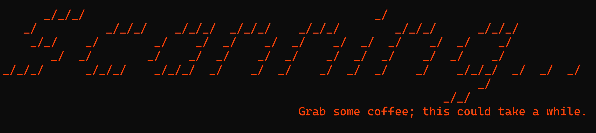
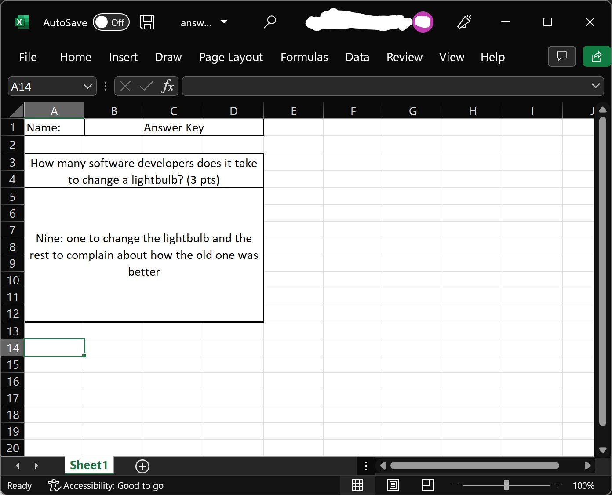
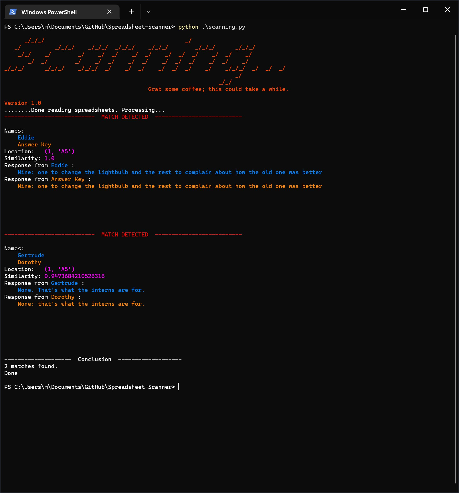
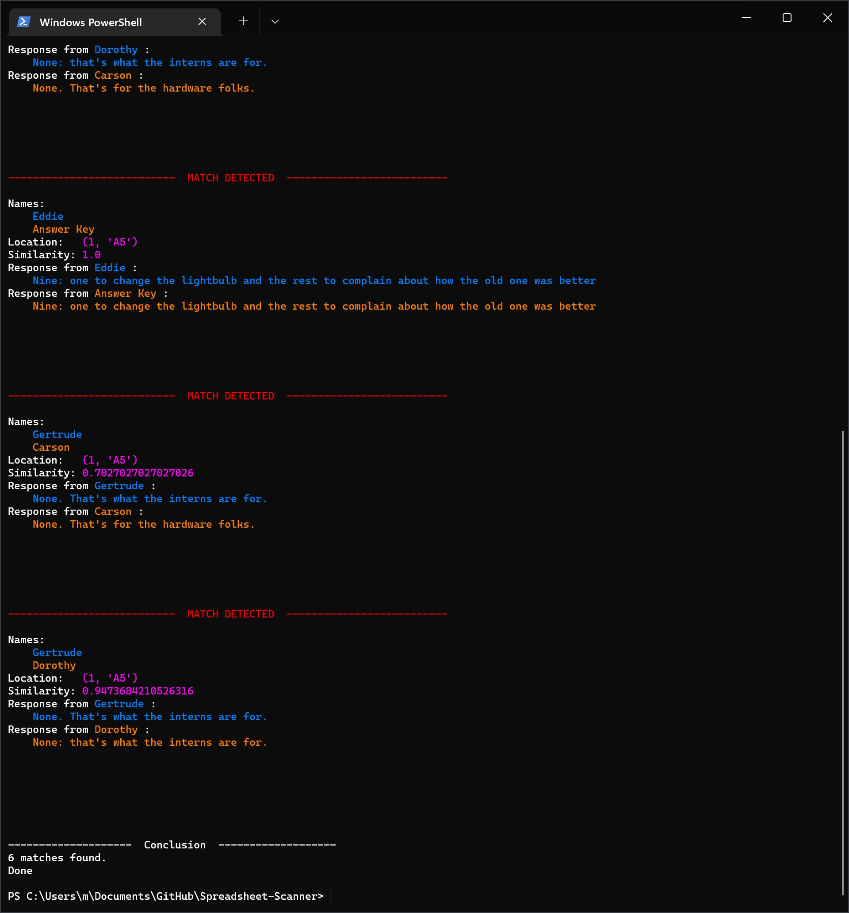

# Spreadsheet-Scanner
A simple Python script that compares cells of similar Excel spreadsheets. A possible application might be to check for original responses in several homework submissions that are based on a template.


## Usage:
1. Get Python, at least 3.10
2. Get dependencies with `python -m pip install levenshtein openpyxl`
3. Download all the submissions. The script can filter out any duplicates with the same values for the name cell. For example, see the [examples](/example/) folder
4. Place this script in that folder. Configure the options on lines 20-50 if need be
5. Run the script. It may take a few minutes, so wait patiently.

## Example
Alice, Bob, Carson, Dorothy, Edward, Frank, and Gertrude are all in the same class, graded on the most important question anyone can ask: "How many software developers does it take to change a lightbulb?" 

The professor decided it would be most logical to organize the assignment into a spreadsheet and conveniently provided an answer key for grading purposes: *"Nine: one to change the lightbulb and the rest to complain about how the old one was better"*. She then removes the answers and provides the file to her students as a template.



Most students in this class are very studious, hard workers, and come up with their own work, and some work is not original.

* **Alice** has a long-winded answer: *"It depends on the specs of the lightbulb and the competence of the software developer, so it must take several assumptions to create one definitive answer to this question. But generally speaking, it takes at least one software developer to change a lightbulb."* 
* **Bob** works with Frank to come up with a different answer: *"None: that's a hardware issue."*
* **Carson** thinks hard and finds the same answer as Bob and Frank. *"None. That's for the hardware folks."*
* **Dorothy** finds yet another answer: *"None: that's what the interns are for."*
* **Edward** thinks he's clever by Chegging the answer key. He copies it down and signs his name on it.
* **Frank** works with Bob and submits a copy of Bob's work.
* **Gertrude** peeks over Dorothy's shoulder and copies her answer, but not exactly. *"None. That's what the interns are for.*"

**The grader can tell who's work is original in a matter of minutes.**

He opens the script and sets the path to the folder:
```python
path = os.path.join(os.getcwd(), 'example')
```

Then he sets cell with the names of each student:
```python
nameCell = (1, "B1")       # 1st sheet, B1
```

Then he adjusts the search sensitivity. Finding the right number is an art. He choses a value of 90% to look for blatant plagiarism:
```python
similarityThreshold = 0.9  # Must be a 90% match
```

Finally, he makes a list of all the answer boxes to search, which is just one in this example:
```python
cellsToCheck = [
    (1, "A5")              # 1st sheet, A5
]
```

He runs the script, and within seconds he finds copies:



You might be wondering, *"What if `similarityThreshold` was something lower like 60 percent?"* Well that's exactly what the grader thought, and great minds think alike. Here's an excerpt of the output:



Note that at this threshold, unique answers are flagged as matches.

Generally speaking, the larger the response, the lower this threshold can be before flagging copies.


## Acknowledgements
I'd like to give a special thanks to all the developers who have generously donated their time to make these this project possible:

* The [Python Software Foundation](https://www.python.org/)
* Antti Haapala, David Necas, and the rest of the community behind the [Python-Levenshtein library](https://github.com/ztane/python-Levenshtein)
* Eric Gazoni and Charlie Clark for the [openpyxl](https://openpyxl.readthedocs.io/en/stable/) library
